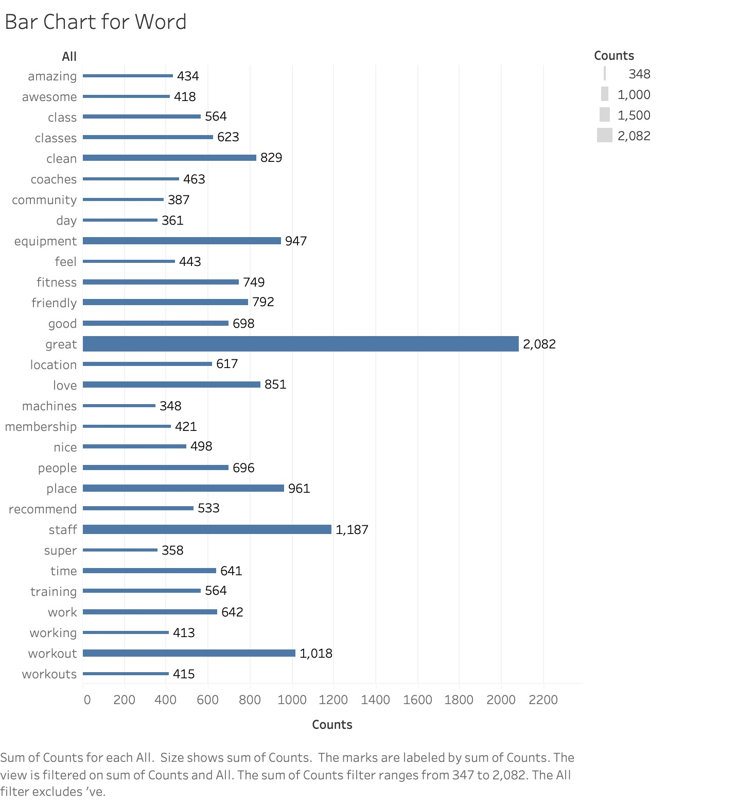
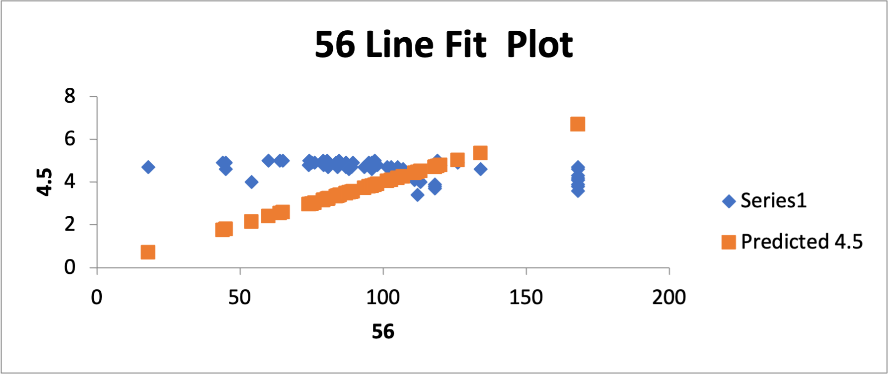

# Group 2 Midterm Project Report

## Goal

The main goal of our project is to analyze reviews of different gyms in Austin. Although our beloved Gregory gym on campus is a phenomenal place to work out, sadly we can no longer use it once we graduate from this program. So we thought it would be a cool idea to use some of the tehnologies we learned in class and also some new ones to see which gyms in Austin (especially Travis County) have good reviews and also explore various characteristics that make a good gym (that people love). We use tools suchs such but not limited to, Google Places API, Natural Language Processing (NLP), sentiment analysis, and Tableau.

## Data

### Sources / Collection Methods

We collected gym data and their Google reviews using 1."Google Places API" and 2."Outscraper".

1. Google Places API
- Scrape 60 gym data(google place id, address, latitude, longitude, etc.) from Google Places API
- Query(Searching words) used: ***Gym near Travis county***

2. Google Review Data (from Outscraper Website/API)
- Outscraper(https://outscraper.com/) is the website we used get reivews data from Google Maps (you can also use their API).
- We plugged in google place id that we collected from Google Places API into Outscraper and was able to collect reviews of each gyms up to 250 recent reviews.
    - We resorted to using Outscraper because Google Places API only allowed us to scrape up to five reviews per location as an individual(non-buseinss) user.
    - Using Outscraper allowed us to scrape up to 250 reviews per gym at an affordable cost.

## Analysis

### Methodology
[Procedures]
1. Word count
     * 1.1 All word count
     * 1.2 word count by each places
     * 1.3 word count by each genders
        - We used **NLTK.tokenizer** package to divide each reviews into the tokens(1.1-1.3)
        - Next, we excluded stopwords and additional stopwords in the tokens(1.1-1.3)
        - Counting all of tokens(1.1)
        - Counting all of tokens by each places(1.2)
        - Counting all of tokens by each gender(1.3) with **gender guesser** package

[Packages]
* NLTK: https://www.nltk.org/index.html
* gender guesser: https://pypi.org/project/gender-guesser/

2. Sentiment Analysis
[Procedures]
    * 2.1 Getting sentiment scores(Positive/Negative/Neutral/Compound) by each reviews  
    * 2.2 Mean and Standard Deviation of sentiment scores by each places
        - We used **NLTK.Vader** package to get sentiment scores by each reviews
        - We pushed each reviews into vader_analyzer function by NLTK.Vader package and got scores
        - After that, we also got the mean and the standard deviation of these scores by each places

[Packages]
* NLTK: https://www.nltk.org/_modules/nltk/sentiment/vader.html

[Database and Figures]

All of our plots and figurese in our findings were created via Tableau. We converted the gym/review data ('basic.csv,' and 'all_count.csv') into PostgresSQL database and created tables. The two csv files that were used in this step were  We then connected the SQL database to Tableau and produced below charts and graphs to visualize our findings.

### Description and Findings

- Gym Location
    

- Gym Distribution by Zipcode
    

- Bar Chart Showing Total Word Count
    

- Bar Chart Showing Word Count - Male
    

- Bar Chart Showing Word Count - Female
    

- NEED TO REVIEW
    

- Google Ratings and Business Hour
    

-GOOGLE RATINGS AND VADER COMPOUND MEAN?

-PIE CHART SHOWING MALE VS FEMALE?
-PIE CHART SHOWING ZIPCODE?

### Limitations

-   We were only able to scrape 60 gyms. If we wanted more, we were required to apply and pay for a business license to retrieve more data.
-   The gyms we collected data on have Google review ratings from 3.5 to 5. So, gyms with terrible to sub-par reviews (1 to 3) are not included.
-   Google Places API selected gyms based on the searcher's location. That may have caused most of the gyms on our data to be around down town area.
-   Membership fees, which may be an interesting finding, was not included in our analysis because it would require a much more in-depth and complicated data collection/scraping.
-   Regarding gender ratio analysis – we have some unknown gender names. Unisex names may have been mis-categorized.
-   Although some gyms had more than 250 reviews, the version of the Outscraper we utilized was capped at 250. This may have produced incomplete review data.

### Extensions

-   We could collect more gyms's data. Instead limiting to just Travis county, we could include a bigger location.
-   We could include membership prices into our analysis, which could give us more interesting findings.
-   Using a more advanced techonology, we could include a recommendation/search dashboard based on what gym features one values the most (machine age, price, location, hours, etc)
-   Yelp has 'amenities and more' section, where they list info such as whether staff wear masks, private parking is available, military discount is offered, etc. We could perhaps regress Yelp reviews on these amenities to see if we could observe any interesting correlation between various amenities and ratings. (ex. Private parking is associated with higher rating?)

### Reproducibility
