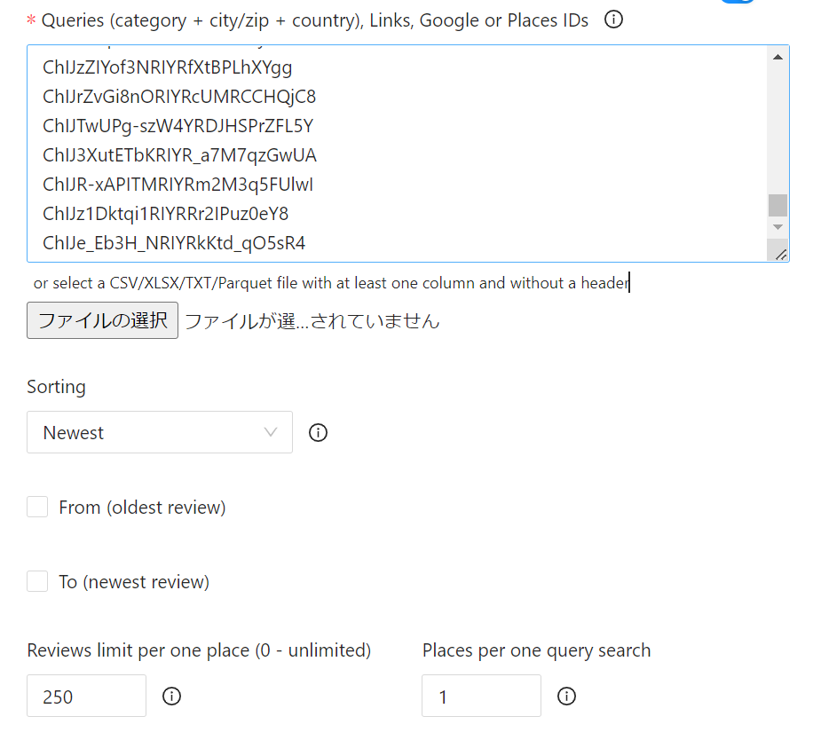
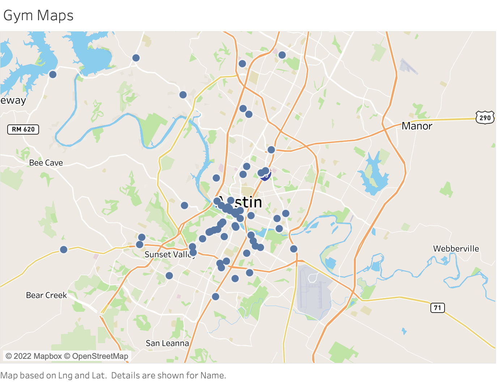
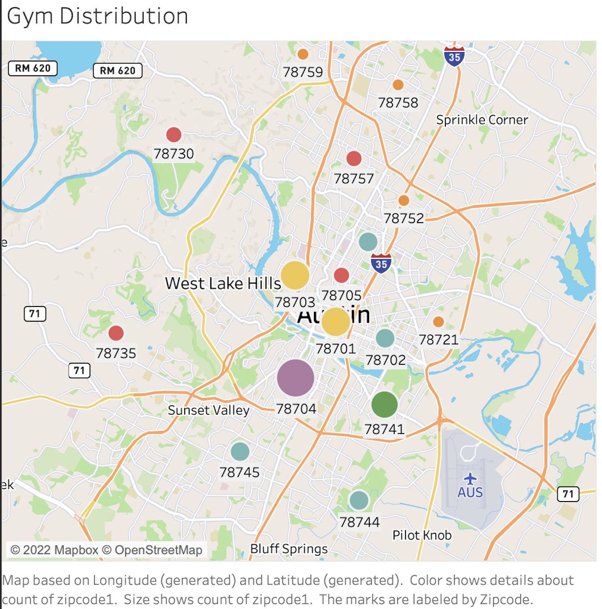
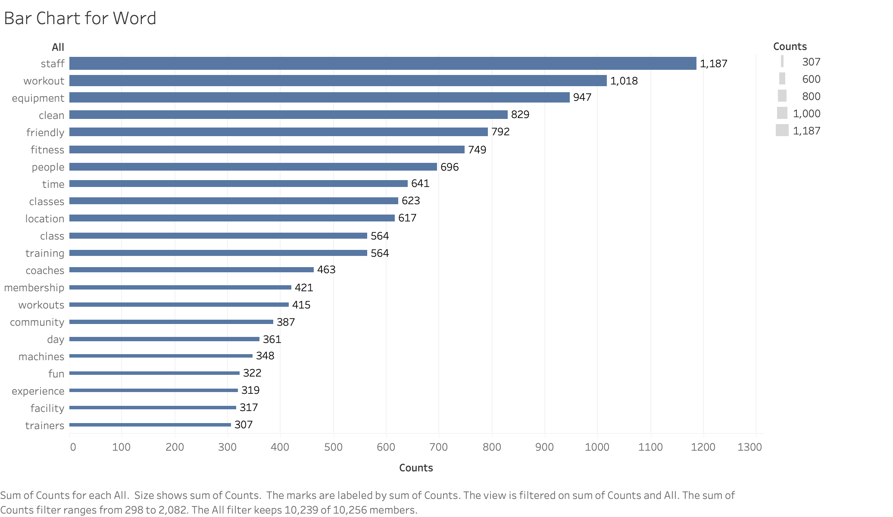
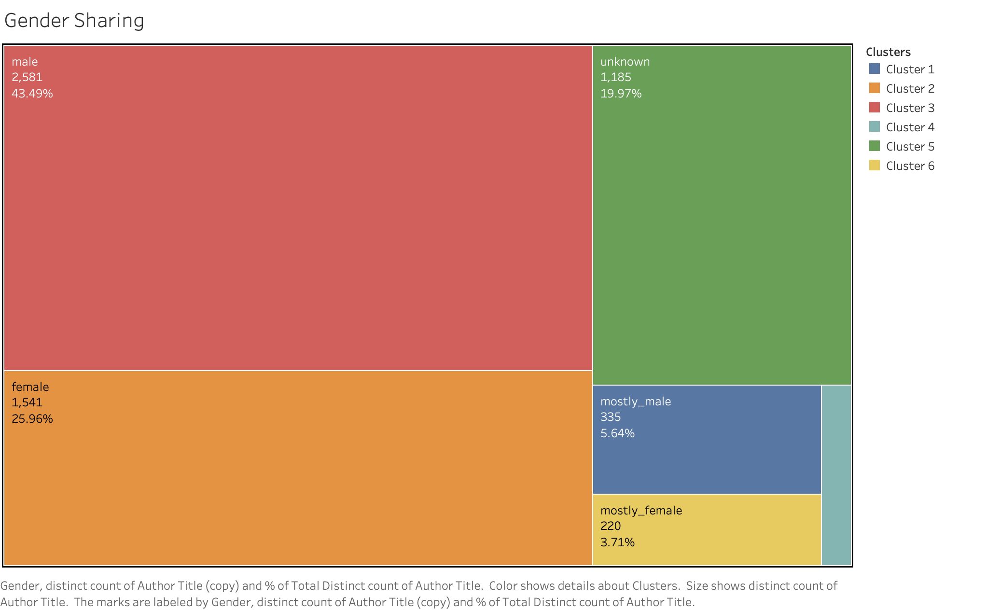
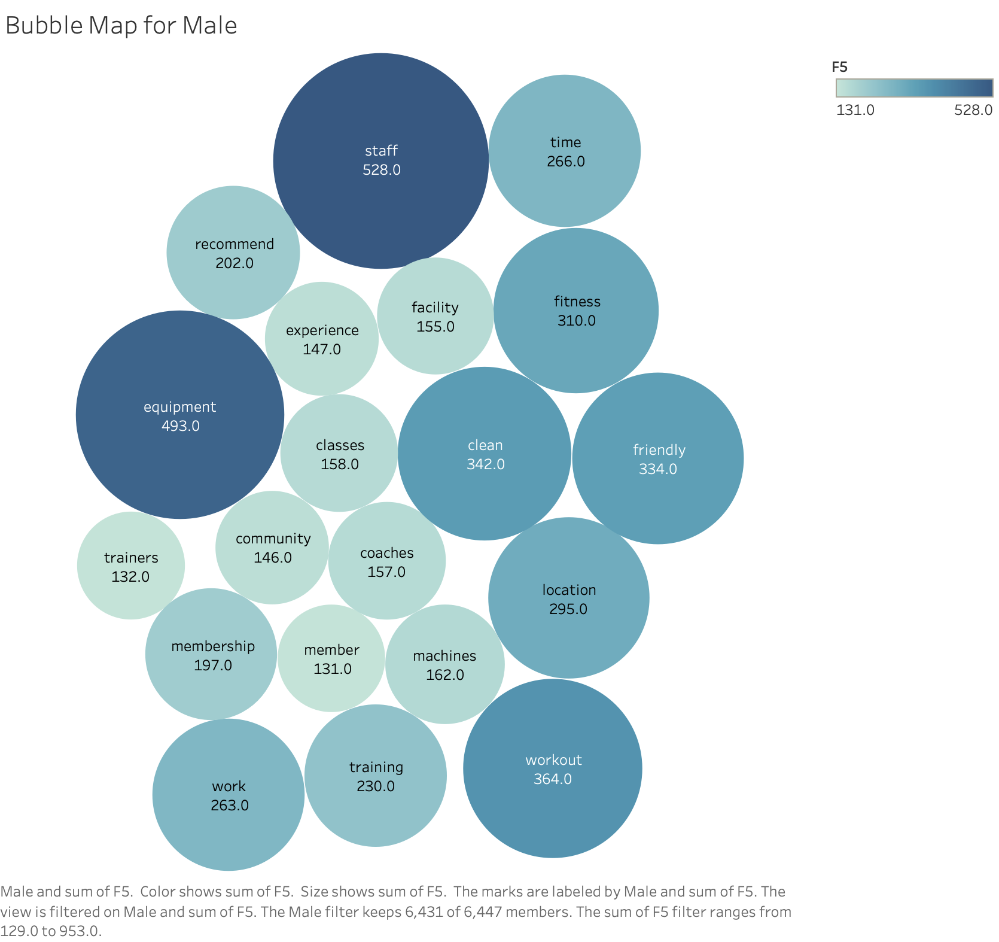
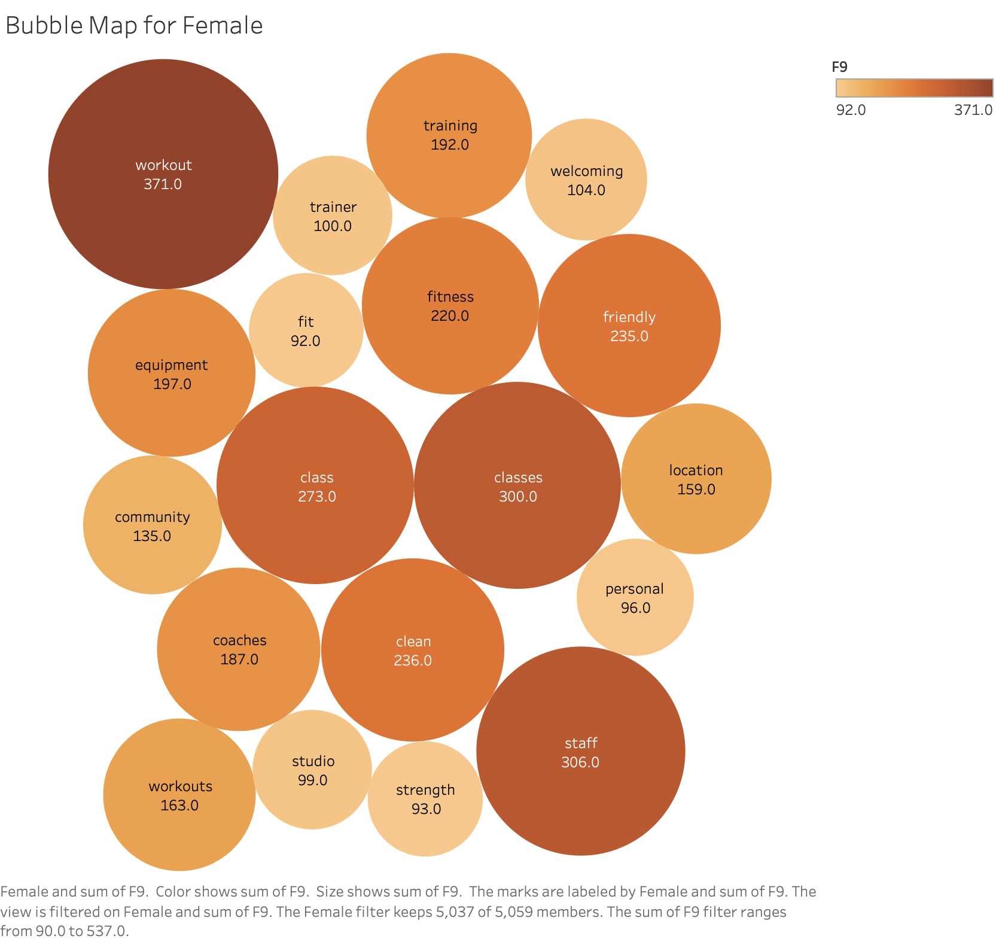
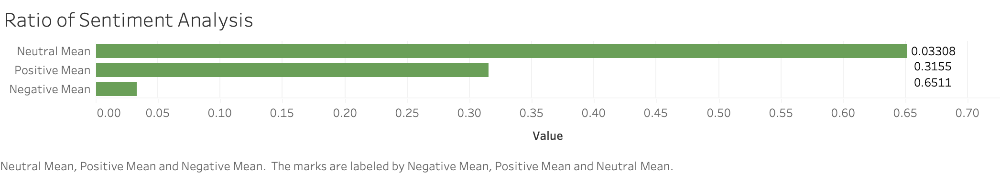

# Group 2 Final Project Report

## Goal

The main goal of our project is to analyze reviews of different gyms in Austin. Although our beloved Gregory gym on campus is a phenomenal place to work out, sadly we can no longer use it once we graduate from this program. So we thought it would be a cool idea to use some of the tehnologies we learned in class and also some new ones to see which gyms in Austin (especially Travis County) have good reviews and also explore various characteristics that make a good gym (that people love). We use tools suchs such but not limited to, Google Map API, Outscraper, Natural Language Processing (NLP), sentiment analysis, and Tableau.

## Data

### Sources / Collection Methods

We collected gym data and their Google reviews using 1."Google Map API" and 2."Outscraper".

**1. Google Map API (googlemap.py)**
- First, before using Google Map API, we go to the Google Cloud Platform and make valid Googe Map API to get its API key
- Insert Google API key and query(search words:"**gym near Travis County, TX**") into googlemap.py
- A) Scrape 60 gym data (**google place id, name, address, latitude, longitude, rating, rating_total**) from Google Map API(function: get_information_map)
- B) Collect details of gyms data and calculated business hours for our analysis (**weekday, Total Business hour**) from Google Map API (function: detail,calculate_hour)
- Create csv files (result_place_id.csv, result_detail.csv) that contain A and B above and Intergrate them into **basic.csv** in the store directory

**2. Google Review Data (from Outscraper Website/API)**
- Outscraper(https://outscraper.com/) is the website we used get reivews data from Google Maps (you can also use their API).
- We plugged in google place id that we collected from Google Map API into Outscraper and was able to collect reviews of each gyms up to 250 recent reviews (**resulting output is 'reviews.csv', which we placed in the data directory **).
    - We resorted to using Outscraper because Google Map API only allowed us to scrape up to five reviews per location as an individual(non-buseinss) user.
    - Using Outscraper allowed us to scrape up to 250 reviews per gym at an affordable cost.
    - We got data that includes **reviews, author_title(reviewr's name), etc.**
    - Output is reviews.csv w

  
We placed Google place ids into outscraper to retrieve the reviews

* Note: We produced reviews.csv at the end of November based on the Google place ids we collected at that time. 
If you collect Google place ids now, you may get slightly different data sets from what we have.

## Analysis

### Methodology
* Main outputs are under the artifacts directory
* Other outputs are under the store directory in the artifacts
* We used pandas package to read and write csv files 

**1. Word Count Analysis (wordcount.py)**

- Read review.csv from Outscraper in the directory
- Used **NLTK.tokenizer** package to break reviews down into separate words
- Excluded stopwords and additional stopwords and cleaned the data (function:tokenized_without_stopwords.py)
    * stopwords are in the stopwords.txt of the data directory, which we retrieved from the Shakespeare homework
    * additional stop words in the additional_stop_words.txt include extra words that we added such as emojis and foreign languages
- CSV files are produced as output

**1.1 All word count (all_count.csv)**
- Count the frequency of all words in the all reviews dataset
- Output is the "all_count.csv" in the artifacts directory

**1.2 Word count by each gym (count_each_place.py)**
- Count the frequency of all words by each gym in the all reviews dataset
- Output is "count_plus_basic.csv" in the store directory (integrated with basic.csv)

**1.3 Word count by each genders (count_each_gender.py)  with *gender-guesser* package**
- Count the frequency of all words by each gym by gender in the all reviews dataset
- Output is included in the "all_coun.csv" in the artifacts directory

* What is the Gender-Guesser package?
    - Python package to guess gender based on the first names provided
    - We plug the first name of each reviwer's name(author title in review.csv) into gender guesser function
    - This funtion retuns six different values: unknown (name not found), andy (androgynous/unisex), male, female, mostly_male, or mostly_female
    - The difference between andy and unknown is that the former is found to have the same probability of being male name as female name(unisex), while the latter means that the name wasn’t found in the gender-guesser's database.

[Packages]
* NLTK (Natural Language Toolkit) : https://www.nltk.org/index.html
* gender-guesser: https://pypi.org/project/gender-guesser/

**2. Sentiment Analysis(sentiment.py)**

**2.1 Sentiment score by each reviews(sentiment_analysis.py)**

NLTK.Vader (Valence Aware Dictionary for Sentiment Reasoning)
- Popular Natural Language Processing tool that identifies and extracts sentiment behind texts.
- Analyzes lexicon, grammatical rules, syntactical conventions to calculate sentiment scores.

- Read review.csv from Outscraper in the directory
- Put the reviews into the function **SentimentIntensityAnalyzer of NLTK Vader** package to get sentiment scores (Positive/Negative/Neutral/Compound)
- Output is "sentimental_data.csv" in the store directory that contains below scores:
    * Positive
    * Negative
    * Netural
    * Compound: Sum of positive, negative and neutral scores, normalized between -1 (most extreme negative) and +1 (most extreme positive)

**2.2 Mean and Standard Deviation of sentiment scores by each places**
- We also get the mean and the standard deviation of these scores by *each places*
- Output is the "senti_plus_count_basic" in the artifacts, which is integrated with other results

**2.3 Creating Reviewer_r.csv**
- Run sentiment.py, which combines the data from reviews.csv and the results from gender-guesser packcage.
- Output is "reviewer_r.csv"

[Packages]
* NLTK.Vader: https://www.nltk.org/_modules/nltk/sentiment/vader.html

[Database and Figures]

All of our plots and figurese in our findings were created via Tableau. We converted the gym/review data ('basic.csv,' and 'all_count.csv') into PostgresSQL database and created tables. We then connected the SQL database to Tableau and produced below charts and graphs to visualize our analyses.

### Description and Findings

- Gym Location
    

The farthest gym returned is near the Oasis at the top left. Most of the gyms are located in the downton area and also below Colorado river. The reasons that there are not many gyms near campus may be:

(a) Google API returns results based on the searcher's location. Our colleague who worked on this lives in downtown area.
(b) Newer apartments in West Campus most likely have their own community gyms, so the demand for commercial gyms may be less in these areas.

- Gym Distribution by Zipcode
    

This map displays concentration of gyms by zipcode. As you can see, most of the gyms are located in zipcode 78701 (downtown area) and 78704 (just below Colorado River).

- Bar Chart Showing Total Word Count
    

The bar graph shows the top twenty two words that appeared the most in the Google reviews. We have ruled out some words such as 'great', 'awesome', 'feel', 'nice,' 'recommend', etc which are relatively meaningeless in our analysis. 'Staff', 'equiptment', 'clean', 'friendly' are some of the words that were highly mentioned. This shows what kind of qualities the reviewers most care about.

Top Five Words Mentioned:
1. staff - 1,187 counts
2. workout - 1,018 counts
3. equipment - 947 counts
4. clean - 829 counts
5. friendly - 792 counts

- Gender Ratio of Reviews
    

Based on the gendger-guesser packcage, males (males + mostly_males) make up almost 50% of the reviewers. Females (females + mostly_females) make up around 30%. 20% are unknown. From this, we can find out that the majority of the reviews that we scraped for this analysis are males.

- Bubble Map Showing Word Count - Male
    

We produced a bubble map showing most frequent words mentioned by males. Similar to the bar graph above, we dropped off meaningless words like 'nice', 'awesome', 'work', 'day', etc.

Top Five Words Mentioned by Males:
1. staff
2. equipment
3. workout
4. clean
5. friendly

- Bubble Map Showing Word Count - Female
    

Top Five Words Mentioned by Females:
1. workout
2. staff
3. classes
4. clean
5. friendly

- Sentiment Analysis
    

Out of nearly 7,000 reviews we scraped, around 65% had average neutral sentiment, 32% positive, and 8% negative. From this analysis, we can make an educated guess that many of the reviews express slightly/moderately positive sentiment(eg. "this gym is good"), rather than extremely positive (eg. "THIS GYM IS FREAKIN AWESOME!!!!!").

Negative sentiment only makes up 3% of the reviews, and this make sense because out the 60 gyms we collected, the lowest Google rating was 3.5.

- Sentiment Analysis and Google Reviews
    

We wanted to see how good of a job NLTK.Vader package does in analyzing sentiment. So, we compared vader's compound mean score (overall sentiment score normalized between -1 to 1) with Google ratings (0-5). We can see the two scores are positively correlated. A gym that has a higher compound mean sentiment score is more likely to have a higher Google review, and vice versa.

- Google Ratings and Business Hour
    

Lastly, we were curious to see if there are any interesting relationships between the Google reviews and how long the gyms are open for. Would gyms that are open longer generally have higher reviews? From above plot, we can see that that the most gyms are open around 80 to 100 hours a week. The range of business hour ranged from 7 hours/week (a local all-around strength training center) to 24/7. Looking at the data, longer business hour (>100 hrs/week) doesn't necessarily guarantee higher reviews. There are many gyms that are open for less than 100 hours/week yet have Google reviews around 4.6-5.

### Limitations

-   We were only able to scrape 60 gyms. If we wanted more, we were required to apply and pay for a business license to retrieve more data.
-   As mentioned previously, if one were to scrape gym review data with Outscraper now, the resulting data may be slightly different from ours because of place ids. Therefore, although we got 60 gyms, the results "senti_plus_count_basic.csv" and "count_each.csv" have only 41 places(reviews of some places are missing)
-   However, "all count.csv" is counted based on 60 gyms that was collected at November.
-   The gyms we collected data on have Google review ratings from 3.5 to 5. So, gyms with terrible to sub-par reviews (1 to 3) are not included.
-   Google Map API selected gyms based on the searcher's location. That may have caused most of the gyms on our data to be around downtown area.
-   Membership fees, which may be an interesting finding, was not included in our analysis because it would require a much more in-depth and complicated data collection/scraping.
-   Regarding gender ratio analysis – we have some unknown gender names. Unisex names may have been mis-categorized.
-   Although some gyms had more than 250 reviews, the version of the Outscraper we utilized was capped at 250. This may have produced incomplete review data.

### Extensions

-   We could collect more gyms's data. Instead of limiting to just Travis county, we could include a bigger location.
-   We could include membership prices into our analysis, which could give us more interesting findings.
-   Using a more advanced technology, we could include a recommendation/search dashboard based on what gym features one values the most (machine age, price, location, hours, etc)
-   Yelp has 'amenities and more' section, where they list information such as whether staff wear masks, private parking is available, military discount is offered, etc. We could perhaps regress Yelp reviews on these amenities to see if we could observe any interesting correlation between various amenities and ratings. (ex. Private parking is associated with higher review?)

### Reproducibility
- Set the current directory to the top of the repo (same place where this README.md is located).
- Before executing the code, install requirement.txt or packages if you do not have them already, by running "pip3 install -r requirements.txt"
- Also, we should pluged your Google Map API key " into "googlemap.py" in the "/code/children".
- Open the main.py under the directory of the code and execute it. (main.py executes these python files automatically: 1. googlemap, 2. wordcount, 3. sentiment, which have some functions in the functions directory)
- After running the above code, you can get three main csv files(all_count, reviewer_r, senti_plus_count_basic) in the artifacts directory.

