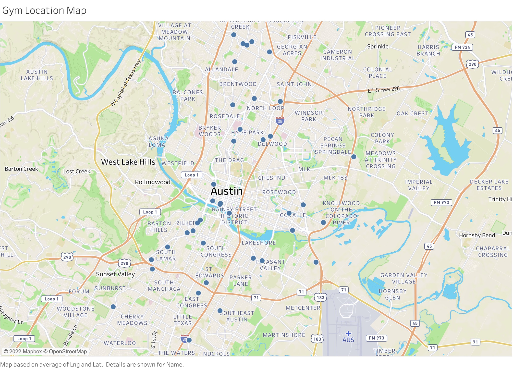

# Group 2 Midterm Project Report

## Goal

The main goal of our project is to analyze reviews of different gyms in Austin. Although our beloved Gregory gym on campus is a phenomenal place to work out, sadly we can no longer use it once we graduate from this program. So we thought it would be a cool idea to use some of the tehnologies we learned in class and also some new ones to see which gyms in Austin (especially Travis County) have good reviews and also explore various characteristics that make a good gym (that people love). We use tools suchs such but not limited to, Google Places API, Natural Language Processing (NLP), sentiment analysis, and Tableau.

## Data

### Sources / Collection Methods

We collected gym data and their Google reviews using 1."Google Places API" and 2."Outscraper".

**1. Google Map API(googlemap.py)**
- First, before using Google Map API, we go to the Google Cloud Platform and make valid Googe Map API to get its API key
- Insert google api key and query(search words:"**gym near Travis County, TX**") into the googlemap.py
- A. Scrape 60 gym data(**google place id, name, address, latitude, longitude, rating, rating_total**.) from Google Map API(function:get_information_map)
- B. Getting details gyms data and calculated business hour that we need to analyze(**weekday, Total Business hour**) from Google Map API(function: detail,calculate_hour)
- Create csv fies(result_place_id.csv, result_detail.csv) that includes A and B above and Intergrate them into **basic.csv** in the store directory

**2. Google Review Data (from Outscraper Website/API)**
- Outscraper(https://outscraper.com/) is the website we used get reivews datafrom Google Maps (you can also use their API).
- We plugged in google place id that we collected from Google Places API into Outscraper and was able to collect reviews of each gyms up to 250 recent reviews (**reviews.csv in the data directory **).
    - We resorted to using Outscraper because Google Places API only allowed us to scrape up to five reviews per location as an individual(non-buseinss) user.
    - Using Outscraper allowed us to scrape up to 250 reviews per gym at an affordable cost.
    - We got data that includes **reviews, author_title(reviewr's name) and etc.**(we used these two items in this )

  
We placed Google place id into outscraper to get up to 250 reviews

* Caution!: We got reviews.csv at the end of November based on the Google place id at that time. And, the Google place ids that we can now get are a little different from ones that we got at November. 

## Analysis

### Methodology
* Main outputs are under the artifacts directory
* Other outputs are under the store directory in the artifacts
* We used pandas package to read and write csv files 

**1. Word count Analysis(wordcount.py)**
- Reading: Read review.csv from Outscraper in the directory
- Dividen: Used **NLTK.tokenizer** package to divide each reviews into each words
- Cleaning: Excluded stopwords and additional stopwords from dividen words(function:tokenized_without_stopwords.py)
    * stopwords is words in the stopwords.txt of the data directory and it is the same as stuff of shakespire homework
    * additional stop words in the additional_stop_words.txt that we added some words for this analysis
- Getting: getting data for this analysis

**1.1 All word count(all count)**
- Counting: the frequency of words in the all reviews dataset
- Output: This result is in the "all count.csv" in the artifacts

**1.2 Word count by each places(count_each_place.py)**
- Counting all of the frequency of words by each places in the all reviews dataset
- Output: This result is in the "countall count.csv" in the store

**1.3 Word count by each genders(count_each_gender.py)  with *gender guesser* package**
- Counting all of the frequency of words by each places in the all reviews dataset
- Output: This result is in the "review_data.csv" in the store

* What is th gender guesser
    - It is the package to estimate gender from last name.
    - We plug last name of each reviwer's name(author title in the review.csv) into gender guesser function
    - This funtion retuns 5 answers from last name, unknown (name not found), andy (androgynous), male, female, mostly_male, or mostly_female
    - The difference between andy and unknown is that the former is found to have the same probability to be male than to be female, while the later means that the name wasn’t found in the gender guesser's database.

[Packages]
* NLTK: https://www.nltk.org/index.html
* gender guesser: https://pypi.org/project/gender-guesser/

**2. Sentiment Analysis(sentiment.py)**

**2.1 Sentiment score by each reviews(sentiment_analysis.py)**
- Reading: Read review.csv from Outscraper in the directory
- Scoring: Putting each reviews into the function **SentimentIntensityAnalyzer of NLTK Vader** package to get scores(Positive/Negative/Neutral/Compound)
- Output: This result is in the "sentimental_data.csv" in the store
    * Positive: positive word's score by each reviews
    * Negative: negative word's score by each reviews
    * Netural : netutral word's score by each reviews
    * Compound: compound score by each reviews

**2.2 Mean and Standard Deviation of sentiment scores by each places**
- Mean/Standard Deviation: We also got the mean and the standard deviation of these scores by *each places*
- Output: This result is in the "senti_plus_count_basic" in the artifacts with being integrated with other results

**2.3 CreatingReview_r**
- The sentment.py includes after reading reviews.csv, we create **review_r.csv** added to gender guesser from author title in the reveiw.csv.

[Packages]
* NLTK: https://www.nltk.org/_modules/nltk/sentiment/vader.html

[Database and Figures]

All of our plots and figurese in our findings were created via Tableau. We converted the gym/review data ('basic.csv,' and 'all_count.csv') into PostgresSQL database and created tables. The two csv files that were used in this step were  We then connected the SQL database to Tableau and produced below charts and graphs to visualize our findings.

### Description and Findings

- Gym Location
    

- Gym Distribution by Zipcode
    

- Bar Chart Showing Total Word Count
    

- Gender Ratio
    

- Bubble Map Showing Word Count - Male
    

- Bubble Map Showing Word Count - Female
    

- Sentiment Analysis
    

- Sentiment Analysis and Google Reviews
    

- Google Ratings and Business Hour
    

### Limitations

-   We were only able to scrape 60 gyms. If we wanted more, we were required to apply and pay for a business license to retrieve more data.
-   The gyms we collected data on have Google review ratings from 3.5 to 5. So, gyms with terrible to sub-par reviews (1 to 3) are not included.
-   Google Places API selected gyms based on the searcher's location. That may have caused most of the gyms on our data to be around down town area.
-   Membership fees, which may be an interesting finding, was not included in our analysis because it would require a much more in-depth and complicated data collection/scraping.
-   Regarding gender ratio analysis – we have some unknown gender names. Unisex names may have been mis-categorized.
-   Although some gyms had more than 250 reviews, the version of the Outscraper we utilized was capped at 250. This may have produced incomplete review data.

### Extensions

-   We could collect more gyms's data. Instead limiting to just Travis county, we could include a bigger location.
-   We could include membership prices into our analysis, which could give us more interesting findings.
-   Using a more advanced techonology, we could include a recommendation/search dashboard based on what gym features one values the most (machine age, price, location, hours, etc)
-   Yelp has 'amenities and more' section, where they list info such as whether staff wear masks, private parking is available, military discount is offered, etc. We could perhaps regress Yelp reviews on these amenities to see if we could observe any interesting correlation between various amenities and ratings. (ex. Private parking is associated with higher rating?)

### Reproducibility
- Set the current directory to the top of the repo (same place where this README.md is located).
- Before executing the code, install requirement.txt or packages if you do not have them already, by running "pip3 install -r requirements.txt"
- Open the main.py under the directory of the code and execute it. (main.py executes these python files automatically: 1. googlemap, 2. wordcount, 3. sentiment, which have some functions in the functions directory)
- After running the above code, you can get three main csv files(all_count, review_r, senti_plus_count_basic) in the artifacts directory.

